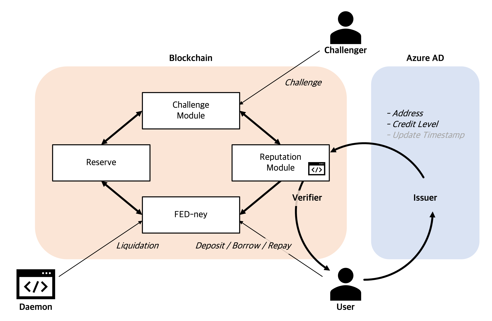
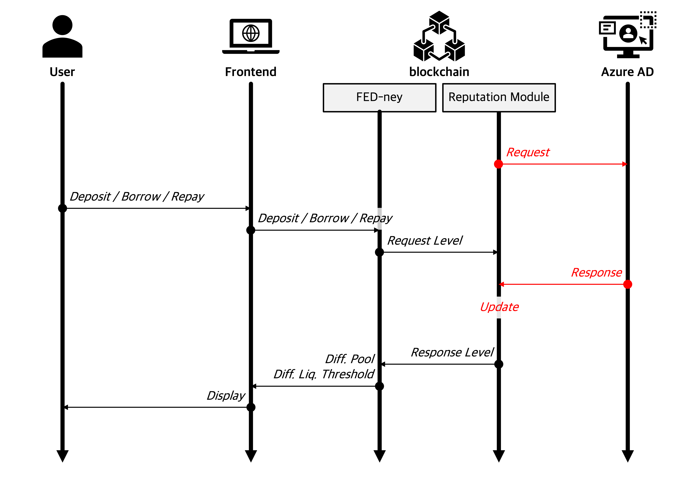
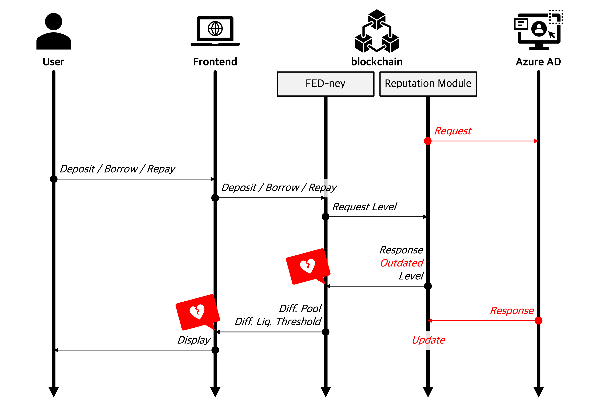
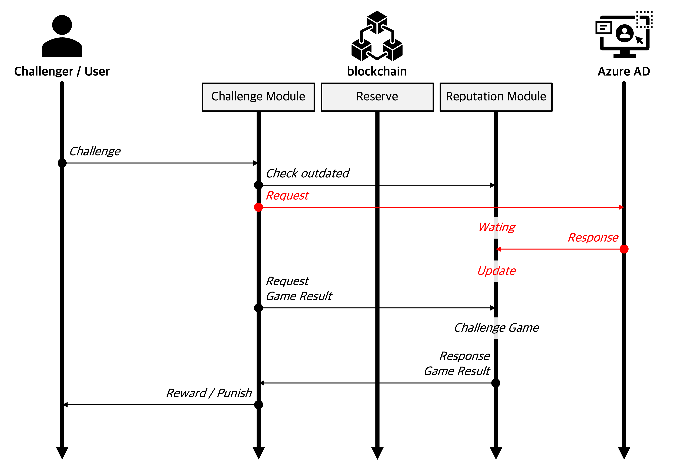

# FED-ney: Azure AD based Lending De-Fi with Credit Rating

> based on [Azure MD](https://docs.microsoft.com/en-us/azure/active-directory/verifiable-credentials/decentralized-identifier-overview)

## Microsoft decentralized identity hackathon

Click on the image above to see the demonstration.

Submitted to [Microsoft decentralized identity hackathon](https://devpost.com/software/fed-ney-azure-ad-based-lending-de-fi-with-credit-rating).

## Inspiration

Today's De-Fi services rely on massive over-collateral. The reason why credit loans cannot be implemented in the blockchain is that there is an "easy creation of fake identity", that is, Sybil attack.

If it is possible to identify, store and retrieve credit ratings from reliable one, the concept of credit loans could be brought to the De-Fi ecosystem.

## What it does

FED-ney uses DID to allocate and utilize credit ratings for each address. 

A high credit rating (Gold) means that he has a good debt repayment ability, so the proportion of debt per collateral can be enhanced into 70%. In addition, exclusive features such as stable deposits/borrowings are only allowed for him.

In contrast, users with low credit rating (Silver and Bronze) have lower liquidation threshold (60% and 50% respectively). Also they cannot participate in stable pools.

## How we built it

There are four main smart contracts in the FED-ney system.

### FED-ney

FED-ney contract handles basic lending requests such as `deposit`, `borrow`, and `repay`.

### Reputation Module

Reputation module and related daemon process request user's characteristic data to Azure AD, and store it in contract storage.

### Challenge Module

Challenge module is used when someone wants to tackle someone else's action/transaction.

The malicious someone uses not an up-to-date credit (reputation), therefore, the challenge game is needed to mitigate it.

### Reserve

Reserve contract collects and stores system fees.

The reserve fund is used when permanent losses occur.

## Challenges we ran into

Outdated data (level of credit) has been used because of asynchronization between Azure MD and contract storage. This kind of malicious situation has damaged the system or other users.

## How we solve it

Therefore, we need someone who mounts a challenge against this situation.

When a challenger starts a "verification game", challenge module and daemon request up-to-date credit level. The challenger is rewarded or punished depending on the result of verification game.

## What's next for FED-ney

* Solidity code test.
* Multiple ownership.
* Tightly synchronized credit rating system between Azure AD and Ethereum.
* Optimization of Gas fee (transaction fee).
